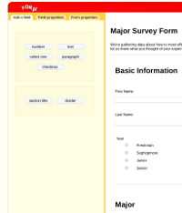

# For*μ*

  *A form building website.*

  ![MainScreenshot]
[MainScreenshot]: ./docs/ForMuFrontPage.png

[Link][link]

[link]: https://formu.herokuapp.com

### Overview
<!--  -->

This website reproduces some of the essential functions of survey monkey's wufoo.com. The site centers on a dynamic form-building application, that allows for drag and drop placement of fields and structural elements. The site also hosts the forms, which can be filled out by anyone with the appropriate link. All responses to a give form are available on the designer's index page.

### Main Features

* User signup, login, and session authentication
* Form-building GUI
* Indexing of created forms for each user
* Online form completion
* Access to results for each form completed

### Implementation

#### Architecture

On the back end, this site is built with Ruby on Rails and uses a PostgreSQL database to store persistent data.

This website is a single-page application. There is one html entry point. All other communication with the back end is carried out with ajax requests and json responses. This allows the site to remain functional while requests are being processed, and contributes especially to a smooth form-design process.

On the front end, the major components of the site were constructed with React, using React Routes. React routes allows components to be easily linked to particular URL path locations, and makes code reuse easy. Since forms play an essential role in the main features of the site, and since they are essentially just a sequence of fields, the site uses a routing scheme to allow fields to be generically but efficiently implemented with flexible options hashes.

The causal architecture of the website follows a Flux design. All information as part of a loop: website -> backend / store-router -> local-store -> website. For instance, when a field is added to the GUI design interface, the user essentially sends a message that gets routed to the local store to add a field, which then gets rendered. When a user saves the form, a message is sent to the backend with the form data, which responds by supplying ids to allow the form to be tracked in the future. Those ids are saved in the store, and send to the view, where they are reflected in the html input objects. This makes debugging especially straightforward, as there is a set path that one can take to figure out exactly where any problem might be occurring.

#### Databases

The site has three main kinds of data: users, forms, and form responses. All three are saved to a collection of tables in a PostgreSQL database.

Forms are split up across three tables: forms, form fields (entries), and form field choices (options for a given entry). Responses are split across two. These tables are accessed by the front end in the form of json objects. JBuilder is used to massage the form data into the form that it will be most easy to use in generating sequences of fields in javascript. On the other end, forms and responses received from the front end are converted into something that active record can easily save into the associated tables in database.
